# PDF/A-3 + PAdES — Specifica per Evidence Layer

> Conservazione digitale a norma AgID per documenti probatori AIComply
> Standard: ISO 19005-3:2012 (PDF/A-3) + ETSI EN 319 142-1 (PAdES) + eIDAS

---

## 1. OBIETTIVO

Trasformare ogni report del Dossier e dell'Evidence Layer in un **PDF/A-3** con:
- Hash SHA-256 del contenuto JSON originale embedded come metadato XMP custom
- Firma PAdES Baseline-B-LT (Long-Term) compatibile con normativa italiana
- Allegato JSON originale incorporato (PDF/A-3 supporta embedded files)
- Metadati strutturati verificabili dall'autorità di vigilanza (Garante Privacy, ACN, AGID)

## 2. PERCHÉ PDF/A-3 (NON A-2 o A-1)

| Versione | Embedded files | Usabilità AIComply |
|----------|---------------|---------------------|
| PDF/A-1  | ❌ Vietati    | ❌ Non utile |
| PDF/A-2  | ✅ Solo PDF/A | ⚠️  Solo se allego un altro PDF |
| **PDF/A-3** | ✅ Qualsiasi file | ✅ Posso allegare il JSON originale del Dossier |

**Vantaggio chiave:** Con PDF/A-3 il file JSON Annex IV originale viene incapsulato nel PDF.
Il verificatore può estrarlo, calcolarne lo SHA-256, e confrontarlo con il valore nei
metadati XMP — verificando in un solo passo integrità + autenticità + non-ripudio.

## 3. METADATI XMP PERSONALIZZATI

Schema namespace custom: `http://aicomply.app/schema/evidence#`

```xml
<rdf:RDF xmlns:rdf="http://www.w3.org/1999/02/22-rdf-syntax-ns#">
  <rdf:Description rdf:about=""
    xmlns:dc="http://purl.org/dc/elements/1.1/"
    xmlns:xmp="http://ns.adobe.com/xap/1.0/"
    xmlns:pdfaid="http://www.aiim.org/pdfa/ns/id/"
    xmlns:aic="http://aicomply.app/schema/evidence#">

    <!-- Standard XMP -->
    <dc:title>Dossier Annex IV — Sistema XYZ</dc:title>
    <dc:creator>AIComply Platform</dc:creator>
    <dc:date>2026-06-05T14:32:00Z</dc:date>
    <xmp:CreatorTool>AIComply v1.2.0</xmp:CreatorTool>
    <pdfaid:part>3</pdfaid:part>
    <pdfaid:conformance>B</pdfaid:conformance>

    <!-- AIComply Evidence Layer custom metadata -->
    <aic:evidenceVersion>1.0</aic:evidenceVersion>
    <aic:evidenceType>dossier_annex_iv</aic:evidenceType>
    <aic:systemId>sys_a1b2c3d4</aic:systemId>
    <aic:systemName>CV-Screener AI</aic:systemName>
    <aic:riskTier>high</aic:riskTier>
    <aic:articleCoverage>Art. 6, 9, 10, 11, 12, 13, 14, 15, 17, 27, 43, 47, 49</aic:articleCoverage>

    <!-- Integrity proof -->
    <aic:contentSha256>e3b0c44298fc1c149afbf4c8996fb92427ae41e4649b934ca495991b7852b855</aic:contentSha256>
    <aic:embeddedJsonFilename>dossier-annex-iv-2026-06-05.json</aic:embeddedJsonFilename>
    <aic:embeddedJsonSha256>fa1f3d7e8c2b9...</aic:embeddedJsonSha256>

    <!-- Signatory -->
    <aic:signatoryName>Mario Rossi</aic:signatoryName>
    <aic:signatoryRole>Chief Compliance Officer</aic:signatoryRole>
    <aic:companyName>Acme S.p.A.</aic:companyName>
    <aic:companyVAT>IT12345678901</aic:companyVAT>

    <!-- Timestamping (RFC 3161) -->
    <aic:timestampAuthority>https://timestamp.aruba.it</aic:timestampAuthority>
    <aic:timestampValue>2026-06-05T14:32:01Z</aic:timestampValue>

    <!-- Chain of trust -->
    <aic:dossierSha256>e3b0...</aic:dossierSha256>
    <aic:evidenceLayerChainHead>9a8b...</aic:evidenceLayerChainHead>

    <!-- Normative references -->
    <aic:applicableRegulation>Reg. UE 2024/1689 + L. 132/2025</aic:applicableRegulation>
    <aic:retentionRequirement>10 years (Art. 18 EU AI Act)</aic:retentionRequirement>
  </rdf:Description>
</rdf:RDF>
```

## 4. FIRMA PAdES — STANDARD ETSI

Profilo: **PAdES Baseline-B-LT** (ETSI EN 319 142-1)

### Componenti firma
- **Subfilter:** `ETSI.CAdES.detached`
- **Algoritmo digest:** SHA-256 (SHA-512 opzionale)
- **Algoritmo firma:** RSA-PSS o ECDSA P-256
- **Timestamp:** RFC 3161 da Trust Service Provider qualificato (TSA EIDAS)
- **CertificateChain:** completa fino a CA root presente nella EU Trusted List
- **RevocationInfo:** OCSP response + CRL incorporati per validità Long-Term (LT)

### Provider qualificati italiani (EIDAS)
| TSP | URL TSA | Note |
|-----|---------|------|
| Aruba PEC | `https://timestamp.aruba.it` | Standard |
| InfoCert | `https://timestamp.infocert.it` | Alternativa |
| Namirial | `https://timestamp.namirial.com` | Alternativa |
| Poste Italiane | `https://timestamp.posteitaliane.it` | PA-friendly |

### Validità probatoria
- **Italia:** Art. 20 CAD (Codice Amministrazione Digitale) — firma elettronica qualificata con cert. EIDAS = piena prova ex art. 2702 c.c.
- **UE:** Regolamento eIDAS (910/2014) Art. 25 — riconoscimento reciproco
- **Conservazione:** 10 anni minimo (Art. 18 EU AI Act + Art. 26(6) AI Act per deployer)

## 5. STRUTTURA PDF/A-3 FINALE

```
DOCUMENT
├── /Metadata          → XMP stream (custom AIComply schema)
├── /Pages             → Contenuto leggibile (sezioni Annex IV)
├── /Names
│   └── /EmbeddedFiles → JSON originale (AFRelationship=Source)
├── /AcroForm          → Campi firma
│   └── /Sig (PAdES B-LT)
└── /Catalog
    ├── /OutputIntent  → sRGB ICC profile (mandatory PDF/A)
    ├── /MarkInfo      → Marked=true (Tagged PDF)
    └── /OCProperties  → Optional content groups (se necessario)
```

## 6. WORKFLOW DI GENERAZIONE

```mermaid
graph LR
    A[JSON Dossier] --> B[Calcola SHA-256]
    B --> C[Render PDF/A-3 base]
    C --> D[Embed JSON as attachment]
    D --> E[Write XMP metadata]
    E --> F[Sign with PAdES B-B]
    F --> G[Add RFC 3161 timestamp]
    G --> H[Upgrade to PAdES B-LT<br/>OCSP+CRL embed]
    H --> I[Validate ISO 19005-3<br/>+ ETSI 319 142]
    I --> J[Output PDF/A-3 firmato]
```



## 7. LIBRERIE CONSIGLIATE

### Node.js (server-side)
| Libreria | Uso |
|----------|-----|
| `pdf-lib` | Costruzione PDF strutturato, embed files |
| `@signpdf/signpdf` | Firma PAdES (richiede placeholder pre-sign) |
| `node-forge` | Hashing, certificate chain manipulation |
| `pdf-a3-saver` (custom) | Conversione PDF base → PDF/A-3 compliant |

### Approccio raccomandato
1. **Server-side** (Node.js + Vercel function): generazione PDF/A-3 base + embed
2. **HSM/USB token** (client-side via WebUSB): firma con cert. qualificato in possesso dell'utente
3. **Timestamping**: chiamata HTTPS al TSA al completamento firma

### Alternativa: integrazione DocuSign / Aruba Sign
Per firma remota qualificata senza HSM lato client, integrare API DocuSign EU Qualified Signature
o Aruba Sign Pro Web Service.

## 8. STRUTTURA METADATI VERIFICA AUTORITÀ

Quando un'autorità ispeziona il PDF:

```bash
# 1. Estrai XMP
pdfinfo -meta dossier.pdf > metadata.xml

# 2. Verifica firma PAdES
verify-pdf --signed dossier.pdf --check-revocation --check-timestamps

# 3. Estrai JSON embedded
pdf-attach extract dossier.pdf dossier-original.json

# 4. Calcola SHA-256 e confronta
sha256sum dossier-original.json
# → deve coincidere con aic:embeddedJsonSha256 dal metadata

# 5. Verifica timestamp RFC 3161
openssl ts -verify -in dossier.tsr -data dossier.pdf -CAfile trusted-list-eidas.pem
```

Se tutti i 5 controlli passano → documento ammissibile come prova in giudizio
ex Art. 20 CAD + Art. 2702 c.c.

## 9. INTEGRAZIONE CON EVIDENCE LAYER AICOMPLY

Ogni evidence record nel database avrà nuovo campo:

```typescript
interface Evidence {
  // ... campi esistenti ...
  pdfA3Url?:           string;   // URL PDF/A-3 firmato
  pdfA3Sha256?:        string;   // Hash del PDF firmato
  signatureValid?:     boolean;  // Verifica firma PAdES
  timestampedAt?:      string;   // RFC 3161 timestamp
  signatoryCert?:      string;   // Certificato firmatario (DN)
  retentionExpiresAt?: string;   // Data scadenza obbligo retention
}
```

## 10. ROADMAP IMPLEMENTAZIONE

| Fase | Deliverable | Effort |
|------|-------------|--------|
| 1 | PDF/A-3 base con XMP custom + embed JSON | 3 giorni |
| 2 | Integrazione firma PAdES B-B (cert. self-signed per dev) | 2 giorni |
| 3 | Integrazione TSA RFC 3161 (Aruba/InfoCert) | 1 giorno |
| 4 | Upgrade a B-LT (OCSP + CRL embed) | 2 giorni |
| 5 | UI per firma con HSM / token USB (WebUSB API) | 5 giorni |
| 6 | UI per firma remota (DocuSign EU Qualified / Aruba Sign) | 4 giorni |
| 7 | Verificatore web — upload PDF, mostra integrità + chain of trust | 3 giorni |

**Totale: ~20 giorni-uomo per Evidence Layer enterprise-grade**

## 11. RIFERIMENTI NORMATIVI

- **ISO 19005-3:2012** — Document management — Electronic document file format for long-term preservation — Part 3: Use of ISO 32000-1 with support for embedded files (PDF/A-3)
- **ETSI EN 319 142-1 V1.2.1** — PAdES digital signatures — Part 1: Building blocks and PAdES baseline signatures
- **Regolamento (UE) 910/2014 (eIDAS)** — Firma elettronica
- **D.Lgs. 7 marzo 2005, n. 82 (CAD)** — Codice Amministrazione Digitale
- **Linee guida AgID** sulla formazione, gestione e conservazione dei documenti informatici
- **Reg. UE 2024/1689 AI Act** — Art. 18 (record-keeping), Art. 26(6) (retention deployer 6 mesi minimo)
